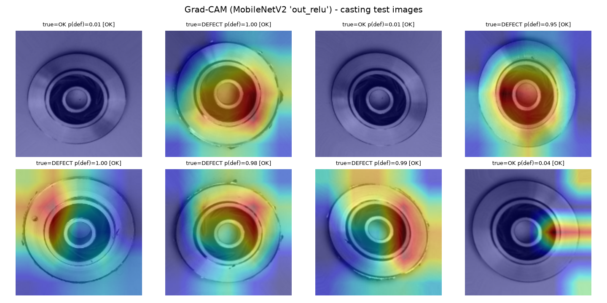

# Block 4 - Casting defect classification (MobileNetV2 transfer learning)

## Test-set metrics (full held-out split)

| run | precision | recall | F1 | ROC-AUC | confusion [ [TN,FP],[FN,TP] ] |
|---|---|---|---|---|---|
| frozen_backbone | 0.9932 | 0.9625 | 0.9776 | 0.9962 | [[259, 3], [17, 436]] |
| fine_tuned | 1.0 | 0.9183 | 0.9574 | 0.9984 | [[262, 0], [37, 416]] |

**Selected: `fine_tuned`** (highest validation AUC). Class 1 = defect.

## Grad-CAM

Grad-CAM uses gradients into the final MobileNetV2 conv block (`out_relu`). On correctly-classified defect castings the activation concentrates on the blow-holes / shrinkage porosity at the casting edge; on OK parts it stays diffuse. Misclassifications (marked WRONG) typically show the heat landing on lighting glare or the circular rim rather than a real defect - a useful failure signature to show a human reviewer.
