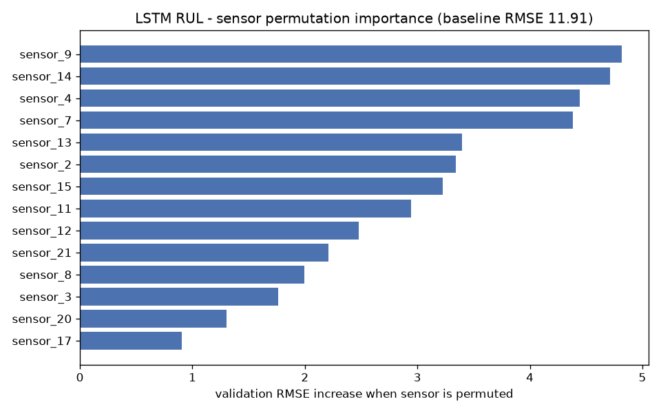

# Block 8 - LSTM RUL sensor importance (permutation)

Baseline validation RMSE: **11.91**

| sensor | RMSE increase when permuted |
|---|---|
| sensor_9 | 4.815 |
| sensor_14 | 4.714 |
| sensor_4 | 4.444 |
| sensor_7 | 4.382 |
| sensor_13 | 3.398 |
| sensor_2 | 3.341 |
| sensor_15 | 3.225 |
| sensor_11 | 2.943 |
| sensor_12 | 2.477 |
| sensor_21 | 2.21 |
| sensor_8 | 1.998 |
| sensor_3 | 1.762 |
| sensor_20 | 1.302 |
| sensor_17 | 0.907 |

The top sensors are the monotonic degradation channels of the CMAPSS turbofan (core temperatures / pressures). Permuting flat or noisy sensors barely moves RMSE, confirming the model relies on the physically meaningful trends.
