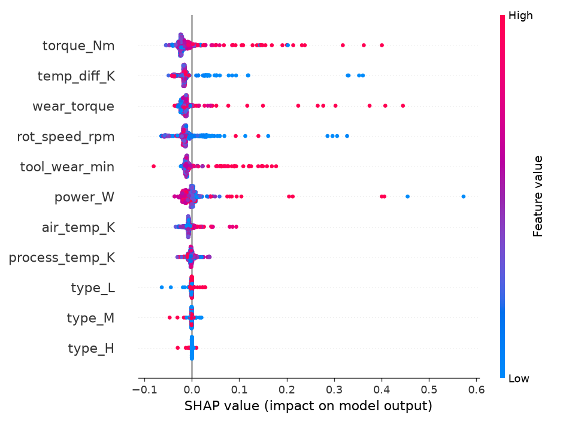
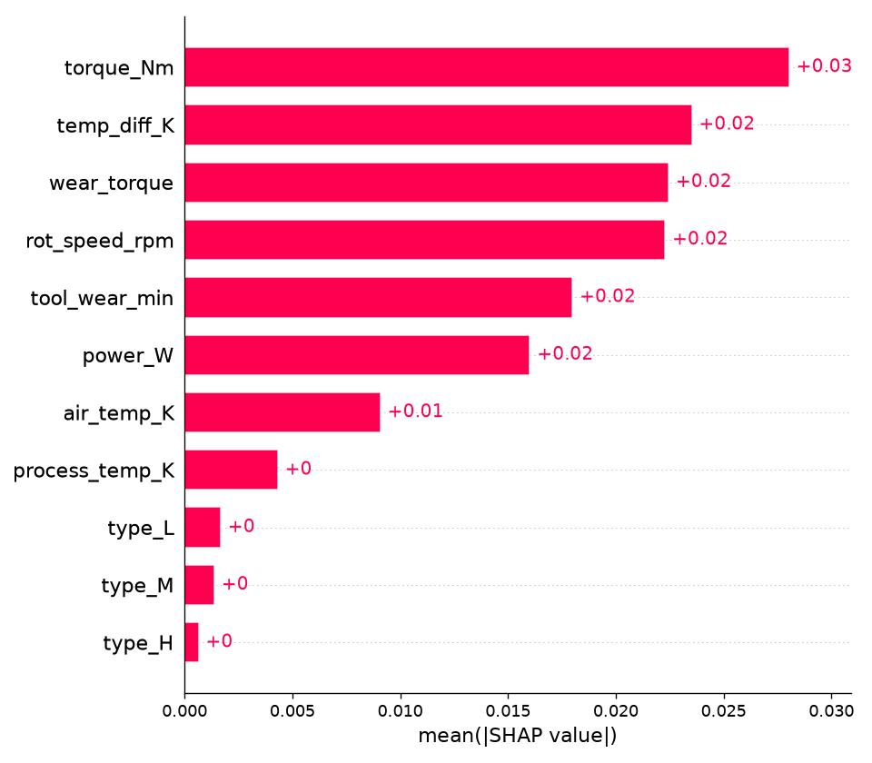

# Block 8 - SHAP feature importance (tabular failure classifier)

## Global ranking (mean |SHAP| on the test set)

| rank | feature | mean |SHAP| |
|---|---|---|
| 1 | torque (`torque_Nm`) | 0.02804 |
| 2 | process-air temp difference (`temp_diff_K`) | 0.02352 |
| 3 | tool-wear x torque (overstrain) (`wear_torque`) | 0.02245 |
| 4 | rotational speed (`rot_speed_rpm`) | 0.02229 |
| 5 | tool wear (`tool_wear_min`) | 0.01799 |
| 6 | mechanical power (`power_W`) | 0.01602 |
| 7 | air temperature (`air_temp_K`) | 0.00908 |
| 8 | process temperature (`process_temp_K`) | 0.00432 |
| 9 | machine type L (`type_L`) | 0.00168 |
| 10 | machine type M (`type_M`) | 0.00138 |
| 11 | machine type H (`type_H`) | 0.00065 |

The engineered overstrain feature `wear_torque` and `torque_Nm` / `power_W` carry most of the signal - consistent with the AI4I failure physics (OSF, PWF, HDF). `type_*` and `air_temp_K` contribute little. These SHAP values feed the per-prediction 'why' shown in the app and the agent explanations.
